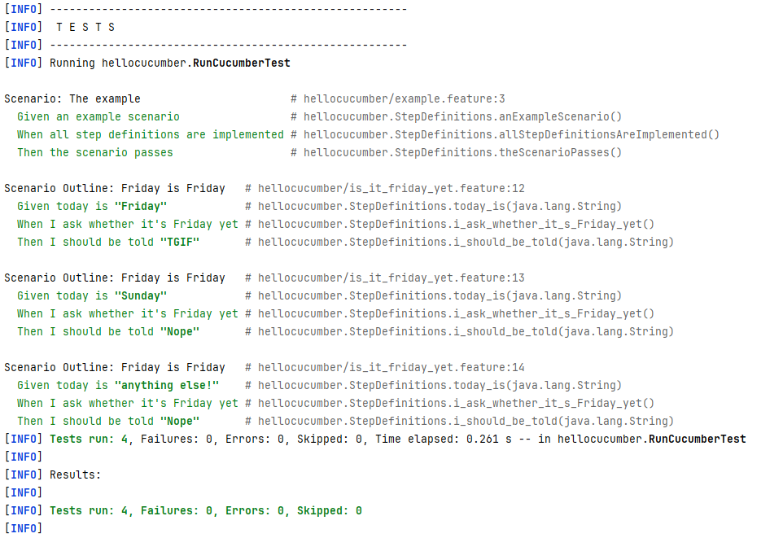
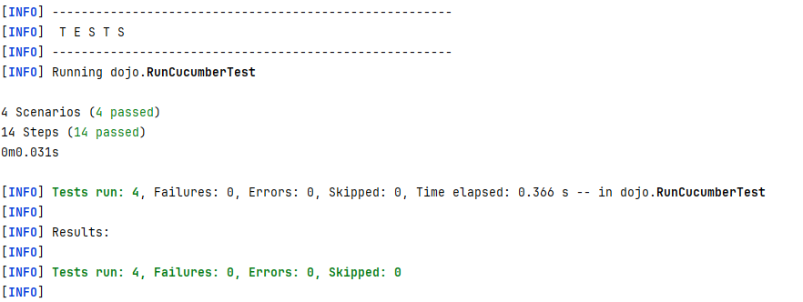
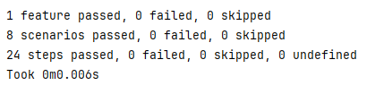

= R5.A.08 -- Dépôt pour les TPs

Ce dépôt concerne les rendus de mailto:enzo.brouxel@etu.univ-tlse2.fr[Enzo BROUXEL]. +
https://classroom.github.com/online_ide?assignment_repo_id=13208153&assignment_repo_type=AssignmentRepo[Open in Visual Studio Code]

== TP1

.is_it_friday_yet.feature
[source,gherkin]
----
# Created by enzob at 11/12/2023
# language: en
Feature: Is it Friday yet?
  # Enter feature description here
  Scenario Outline: Friday is Friday
    Given today is "<day>"
    When I ask whether it's Friday yet
    Then I should be told "<answer>"
    Examples:
      | day            | answer |
      | Friday         | TGIF   |
      | Sunday         | Nope   |
      | anything else! | Nope   |
----

.Exécution des tests du TP1

== TP2
.Order.java
[source,java]
----
package dojo;

import java.util.ArrayList;
import java.util.List;

public class Order {

    private String ordermessage;
    private String from;
    private String to;
    private List<String> cocktails = new ArrayList<>();

    public void declareOwner(String from) {
        this.from = from;
    }

    public void declareTarget(String to) {
        this.to = to;
    }

    public List<String> getCocktails() {
        return this.cocktails;
    }

    public void writeOrderMessage(String message) {
        this.ordermessage = "From " + this.from + " to " + this.to + ": " + message;
    }

    public String getOrderMessage() {
        return this.ordermessage;
    }
}

----

.Exécution des tests du TP2

== TP3

.account.feature
[source,gherkin]
----
# Created by enzob at 13/12/2023
Feature: Account testing

  Scenario: Creating an empty account
    Given John who wants to create an account
    When Creation of the account
    Then The account balance is 0

  Scenario Outline: Deposit money on account
    Given An empty account
    When Deposit <deposit_amount> on the account
    Then After the deposit, the account balance is <balance>
    Examples:
      | deposit_amount | balance |
      | 200            | 200     |
      | 769            | 769     |
      | -8             | 0       |

  Scenario Outline: Withdraw money on account
    Given An account with <initial_amount>
    When Withdraw <withdraw_amount> on the account
    Then After the withdraw, the account balance is <balance>
    Examples:
      | initial_amount | withdraw_amount | balance |
      | 0              | 200             | 0       |
      | 250            | 200             | 50      |
      | 30             | 100             | 30      |
      | 670            | 400             | 270     |
----

.account_steps
[source, python]
----
from behave import *

from account import Account

@given("{name} who wants to create an account")
def step_init_given(context, name):
    """
    :type name:
    :type context: behave.runner.Context
    """
    context.name = name

@when("Creation of the account")
def step_init_when(context):
    """
    :type context: behave.runner.Context
    """
    context.account = Account(context.name)

@then("The account balance is 0")
def step_init_then(context):
    """
    :type context: behave.runner.Context
    """
    assert context.account.get_balance() == 0

@given("An empty account")
def step_deposit_given(context):
    """
    :type context: behave.runner.Context
    """
    context.account = Account('test')

@when("Deposit {amount:n} on the account")
def step_deposit_when(context, amount):
    """
    :type amount: int
    :type context: behave.runner.Context
    """
    context.account.deposit(amount)

@then("After the deposit, the account balance is {balance:n}")
def step_deposit_then(context, balance):
    """
    :type balance: int
    :type context: behave.runner.Context
    """
    assert context.account.get_balance() == balance

@given("An account with {initial_amount:g}")
def step_withdraw_given(context, initial_amount):
    """
    :type initial_amount: float
    :type context: behave.runner.Context
    """
    context.account = Account('test', initial_amount)

@when("Withdraw {amount:n} on the account")
def step_withdraw_when(context, amount):
    """
    :type amount: int
    :type context: behave.runner.Context
    """
    context.account.withdraw(amount)

@then("After the withdraw, the account balance is {balance:n}")
def step_withdraw_then(context, balance):
    """
    :type context: behave.runner.Context
    :type balance: int
    """
    assert context.account.get_balance() == balance

----

Pour ce TP, j'ai décidé de prendre une simple classe python qui représente un compte bancaire. Le but de mes tests en BDD est de contrôler le comportement de cette classe. Exemple : ne pas pouvoir retirer plus d'argent que l'on en dispose.

.Exécution des tests du TP3

